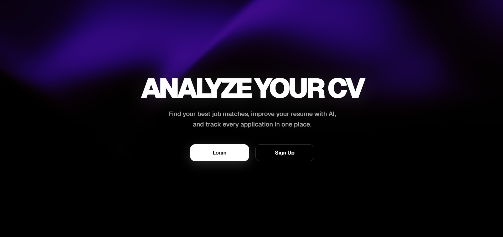

# AI Job Tracker

> **AI-Powered Resume Analysis & Smart Job Application Platform**

Analyze your resume with AI, improve your ATS score, discover the most suitable jobs, and manage all your job applications in one intelligent platform.

---

# 🖼️ Preview

---

# 🌐 Live Demo

### https://ai-job-tracker-eight-snowy.vercel.app/

---

# ✨ Features

- 🤖 AI Resume Analysis
- 🎯 ATS Score Evaluation
- 💼 Smart Job Matching
- 📄 Resume Upload (PDF / DOCX)
- 🧠 AI Career Recommendations
- 📊 Job Application Dashboard
- 🏢 Employer Job Listings
- 🔐 Secure Authentication
- ☁️ Cloud Database with Supabase
- ⚡ Fast Next.js App Router
- 📱 Fully Responsive Design
- 🌙 Modern Dark UI
- 🚀 Smooth Animations
- 📈 Match Score Visualization

---

# 🚀 Project Overview

AI Job Tracker is an AI-powered career platform built to simplify and improve the job application process.

Users can upload their resumes, receive detailed AI-powered feedback, calculate their ATS score, compare their resume against real job descriptions, and track every application from a single dashboard.

The platform integrates Google Gemini AI with Supabase and Next.js to provide intelligent resume analysis, job matching, authentication, cloud storage, and a modern SaaS-style user experience.

This project was developed independently as a portfolio application to demonstrate practical experience in Full Stack Development, Artificial Intelligence integration, Authentication Systems, Database Design, and modern UI/UX development.

---
# ⚙️ How It Works

### 1. Create an Account

Users sign up or log into the platform.

---

### 2. Upload Resume

Upload a PDF or DOCX resume.

The application extracts text automatically.

---

### 3. Browse Jobs

Explore available job listings created by employers.

---

### 4. AI Resume Analysis

Click **Apply Now**.

Google Gemini AI compares:

- Resume
- Job Description

and generates:

- ATS Match Score
- Strengths
- Missing Skills
- AI Recommendations

---

### 5. Save Application

Every application is stored inside Supabase.

Users can revisit previous analyses without generating them again.

---

### 6. Dashboard

The Dashboard provides:

- Average Match Score
- Recent Applications
- AI Analysis Summary
- Interview Statistics
- Offer Statistics

--- 
# 🛠 Tech Stack

## Frontend

- Next.js 16
- React
- TypeScript
- Tailwind CSS
- Lucide React

## Backend

- Supabase
- Authentication
- PostgreSQL Database
- Storage

## Artificial Intelligence

- Google Gemini 2.5 Flash

## Deployment

- Vercel

---

# ⚙️ Core Modules

### 🤖 AI Resume Analyzer

- Resume parsing
- ATS score calculation
- Strength analysis
- Missing skills detection
- Personalized AI recommendations

---

### 💼 Job Applications

- Browse job listings
- Apply directly
- AI match score
- Application history
- Resume-job comparison

---

### 👤 User Profile

- Resume management
- ATS history
- Personal information
- Profile customization

---

### 🏢 Employer Panel

- Create job listings
- Edit listings
- Delete listings
- Manage opportunities

---

# 🔒 Security

- Secure Authentication
- Protected Routes
- Supabase Row Level Security
- Environment Variables
- Secure API Routes
- File Upload Validation
- AI Request Validation

---

# 🚀 Future Improvements

- AI Cover Letter Generator
- Interview Preparation Assistant
- Resume Version History
- AI Career Coach
- Company Insights
- Email Notifications
- Resume Templates
- Multi-language Support
- Advanced Analytics

---

# 📄 License

This project is shared for portfolio and educational purposes.

The source code may not be copied, redistributed, or used commercially without explicit permission from the author.

---

# 👨‍💻 Developer

## Bedirhan Elçik

Management Information Systems Student

### GitHub

https://github.com/Bedirhanelcik

### LinkedIn

https://www.linkedin.com/in/bedirhanelcik/

### Email

bedrhanelck@outlook.com

---

⭐ If you like this project, consider giving it a star on GitHub.
